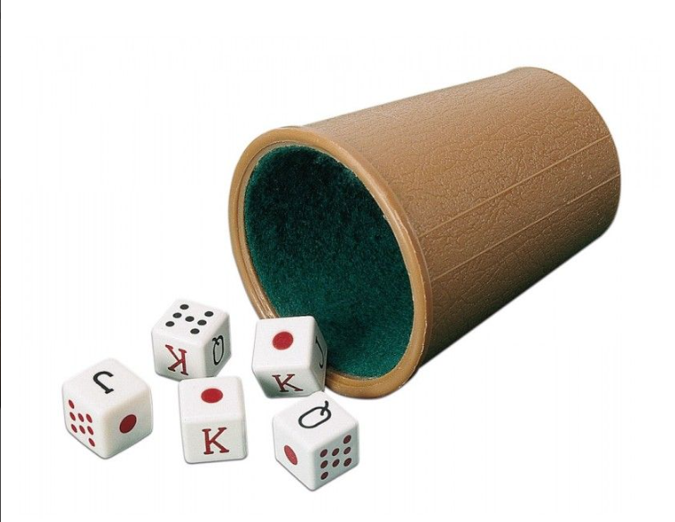

# 🎲 **Dice Challenge**



**Dice Challengue** es un juego de dados basado en turnos, donde los jugadores lanzan dados y eligen una cara para sumar puntos.  
**Gana el jugador con la puntuación más alta al final de la partida.**

## 📋 **Características**

- 🎮 **Multijugador**: Se permite jugar con varios jugadores.
- 🎲 **Lanzamiento de dados**: Cada jugador lanza dados y elige una cara.
- 🏆 **Registro de puntuaciones**: Se registran las puntuaciones de cada turno.
- 🥇 **Ganador**: El jugador con mayor puntuación al final gana la partida.

## 🕹️ **Cómo jugar**

1. 🔧 **Ejecuta el archivo en una terminal con**:

    ```bash
    python dados.py
    ```

2. ➕ **Ingresa el número de jugadores.**

3. 🎲 **Cada jugador lanzará dados y elegirá una cara.**

4. 📊 **Se registran los puntos y se repite el proceso por 6 turnos**

5. 🏆 **Al final, se muestra el ganador.**

## 💻 **Cómo hice el código**

Este proyecto fue implementado en Python utilizando un enfoque basado en diccionarios y bucles, sin el uso de clases:

- **Diccionario de jugadores**: Utilicé un diccionario `listado_jugadores` donde las claves son los nombres de los jugadores y los valores son listas con las puntuaciones de cada jugador para cada cara del dado (inicialmente todas a -1).
  
- **Bucle de turnos**: El juego se estructura en 6 turnos (uno por cada cara del dado). En cada turno, el jugador lanza los dados hasta 3 veces y elige una cara con la que desea jugar. Se validan las elecciones para asegurar que no se elija una cara que ya ha sido seleccionada en ese turno.

- **Aleatoriedad de los dados**: Utilicé el módulo `random` para simular el lanzamiento de los dados y generar las caras aleatorias (números entre 1 y 6).

- **Cálculo de puntuaciones**: Después de cada turno, se registran las puntuaciones en el diccionario de jugadores, y al final se suman las puntuaciones totales para determinar al ganador.

Este enfoque permite una gran flexibilidad en cuanto a la cantidad de jugadores y turnos. Además, al no utilizar clases, el código se mantiene simple y directo, ideal para un juego rápido y fácil de entender.

## ✍️ **Autor**
Juan Natoli
